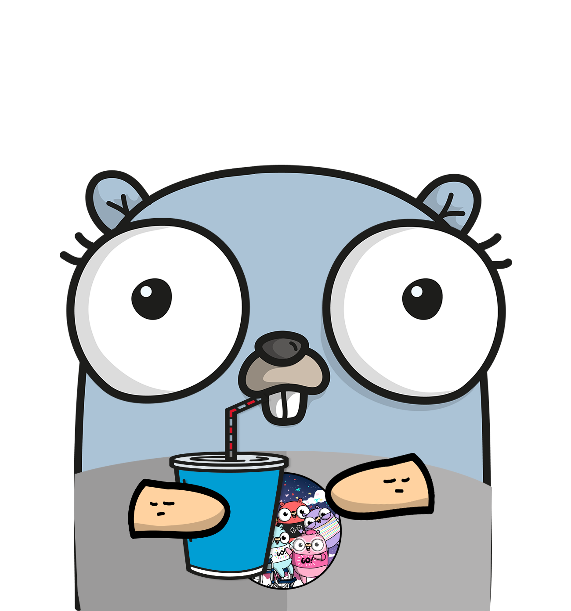

#  GopherTales - Interactive Adventure Game

<div align="center">



**An interactive "Choose Your Own Adventure" web application built with Go**

[](https://golang.org)
[](LICENSE)
[]()

[🚀 Quick Start](#quick-start) • [📖 Documentation](#documentation) • [🏗️ Architecture](#architecture) • [🤝 Contributing](#contributing)

</div>

## 📋 Table of Contents

- [✨ Features](#-features)
- [🚀 Quick Start](#-quick-start)
- [🏗️ Project Structure](#️-project-structure)
- [⚙️ Configuration](#️-configuration)
- [🔌 API Endpoints](#-api-endpoints)
- [🎯 Usage Examples](#-usage-examples)
- [🧪 Testing](#-testing)
- [🚀 Deployment](#-deployment)
- [🤝 Contributing](#-contributing)
- [📄 License](#-license)

## ✨ Features

### 🎮 Interactive Storytelling
- **Dynamic Story Progression**: Navigate through branching storylines with meaningful choices
- **Multiple Endings**: Discover different outcomes based on your decisions
- **Rich Narrative**: Immersive story with colorful characters and engaging plot

### 🎨 Modern Web Experience
- **Responsive Design**: Beautiful UI that works on desktop, tablet, and mobile
- **Smooth Animations**: CSS animations and transitions for enhanced user experience
- **Dynamic Theming**: Different visual themes for each story arc
- **Accessibility**: WCAG compliant design with proper ARIA labels

### 🔧 Technical Excellence
- **Clean Architecture**: Well-structured Go codebase with separation of concerns
- **RESTful API**: JSON endpoints for headless usage and integrations
- **Middleware Stack**: Logging, recovery, CORS, and security headers
- **Graceful Shutdown**: Proper server lifecycle management
- **Configuration Management**: Environment-based configuration
- **Error Handling**: Comprehensive error handling and logging

### 🛡️ Production Ready
- **Security Headers**: XSS protection, content type options, frame options
- **Request Logging**: Detailed HTTP request/response logging
- **Health Checks**: Built-in health check endpoint for monitoring
- **Configurable Timeouts**: Customizable read, write, and idle timeouts

## 🚀 Quick Start

### Prerequisites

- Go 1.21 or higher
- Git

### Installation

1. **Clone the repository**
   ```bash
   git clone https://github.com/Flack74/GopherTales.git
   cd GopherTales
   ```

2. **Install dependencies**
   ```bash
   go mod tidy
   ```

3. **Run the application**
   ```bash
   go run cmd/server/main.go
   ```

4. **Open your browser**
   ```
   http://localhost:8000
   ```

### Docker Installation

```bash
# Build the image
docker build -t gophertales .

# Run the container
docker run -p 8000:8000 gophertales
```

## 🏗️ Project Structure

```
GopherTales/
├── cmd/
│   └── server/
│       └── main.go              # Application entry point
├── internal/
│   ├── config/
│   │   └── config.go            # Configuration management
│   ├── handlers/
│   │   ├── home.go              # Home page handler
│   │   ├── story.go             # Story page handler
│   │   └── api.go               # API endpoints handler
│   ├── middleware/
│   │   └── middleware.go        # HTTP middleware (logging, recovery, etc.)
│   ├── models/
│   │   └── story.go             # Data models and structures
│   └── services/
│       └── story.go             # Business logic layer
├── static/                      # Static assets (CSS, images)
│   ├── *.png                   # Gopher images for different story arcs
│   └── css/                    # Styling
│         ├── home_styles.css
│         └── story_styles.css
# Main stylesheet
├── templates/                   # HTML templates
│   ├── home.html               # Landing page template
│   └── story.html              # Story page template
├── gopher.json                 # Story data file
├── go.mod                      # Go module file
├── go.sum                      # Go dependencies checksum
├── Dockerfile                  # Docker configuration
├── Makefile                    # Makefile for building and running the application
└── README.md                   # This file
```

### Architecture Overview

The application follows a clean architecture pattern:

- **`cmd/`**: Application entry points
- **`internal/`**: Private application code
  - **`config/`**: Configuration management
  - **`handlers/`**: HTTP request handlers
  - **`middleware/`**: HTTP middleware components
  - **`models/`**: Data structures and domain models
  - **`services/`**: Business logic layer
- **`static/`**: Static web assets
- **`templates/`**: HTML templates

## ⚙️ Configuration

The application supports configuration through environment variables:

### Server Configuration

| Variable | Default | Description |
|----------|---------|-------------|
| `PORT` | `8000` | Server port |
| `HOST` | `localhost` | Server host |
| `READ_TIMEOUT` | `15` | Read timeout in seconds |
| `WRITE_TIMEOUT` | `15` | Write timeout in seconds |
| `IDLE_TIMEOUT` | `60` | Idle timeout in seconds |

### Story Configuration

| Variable | Default | Description |
|----------|---------|-------------|
| `STORY_DATA_FILE` | `gopher.json` | Path to story data file |
| `STATIC_DIR` | `./static` | Static files directory |
| `TEMPLATE_DIR` | `./templates` | Templates directory |

### Example Configuration

```bash
# Set custom port
export PORT=3000

# Use custom story file
export STORY_DATA_FILE="/path/to/custom/story.json"

# Run the application
go run cmd/server/main.go
```

## 🔌 API Endpoints

### Web Routes

| Method | Path | Description |
|--------|------|-------------|
| `GET` | `/` | Home page |
| `GET` | `/story?arc={name}` | Story page for specific arc |
| `GET` | `/static/*` | Static file serving |

### API Routes

| Method | Path | Description | Response |
|--------|------|-------------|----------|
| `GET` | `/api/health` | Health check | `{"status": "healthy", "service": "GopherTales", "version": "1.0.0"}` |
| `GET` | `/api/stats` | Story statistics | `{"total_arcs": 7, "total_options": 12, ...}` |
| `GET` | `/api/arcs` | All story arcs | `{"arcs": {...}}` |
| `GET` | `/api/arc?name={name}` | Specific story arc | `{"arc_name": "intro", "arc": {...}}` |

### JSON Response Format

Story content can be accessed as JSON by adding `?format=json` to story URLs or setting the `Accept: application/json` header.

Example:
```bash
curl -H "Accept: application/json" http://localhost:8000/story?arc=intro
```

Response:
```json
{
  "arc_name": "intro",
  "arc": {
    "title": "The Little Blue Gopher",
    "story": ["Once upon a time..."],
    "options": [
      {
        "text": "That bandit story is just from Home Alone 2! Let's hop to New York.",
        "arc": "new-york"
      }
    ],
    "image": "gopher_intro.png"
  }
}
```

## 🎯 Usage Examples

### Running with Custom Configuration

```bash
# Development environment
export PORT=3000
export HOST=0.0.0.0
go run cmd/server/main.go

# Production environment
export PORT=80
export READ_TIMEOUT=30
export WRITE_TIMEOUT=30
export IDLE_TIMEOUT=120
go run cmd/server/main.go
```

### Building for Production

```bash
# Build binary
go build -o gophertales cmd/server/main.go

# Run binary
./gophertales
```

### Cross-Platform Builds

```bash
# Build for Linux
GOOS=linux GOARCH=amd64 go build -o gophertales-linux cmd/server/main.go

# Build for Windows
GOOS=windows GOARCH=amd64 go build -o gophertales-windows.exe cmd/server/main.go

# Build for macOS
GOOS=darwin GOARCH=amd64 go build -o gophertales-macos cmd/server/main.go
```

## 🧪 Testing

### Running Tests

```bash
# Run all tests
go test ./...

# Run tests with coverage
go test -cover ./...

# Run tests with verbose output
go test -v ./...
```

### Manual Testing

1. **Health Check**
   ```bash
   curl http://localhost:8000/api/health
   ```

2. **Story Statistics**
   ```bash
   curl http://localhost:8000/api/stats
   ```

3. **Load Testing** (with Apache Bench)
   ```bash
   ab -n 1000 -c 10 http://localhost:8000/
   ```

## 🚀 Deployment

### Docker Deployment

1. **Create Dockerfile**
   ```dockerfile
   FROM golang:1.21-alpine AS builder
   WORKDIR /app
   COPY go.mod go.sum ./
   RUN go mod download
   COPY . .
   RUN go build -o main cmd/server/main.go

   FROM alpine:latest
   RUN apk --no-cache add ca-certificates
   WORKDIR /root/
   COPY --from=builder /app/main .
   COPY --from=builder /app/static ./static
   COPY --from=builder /app/templates ./templates
   COPY --from=builder /app/gopher.json .
   EXPOSE 8000
   CMD ["./main"]
   ```

2. **Deploy with Docker Compose**
   ```yaml
   version: '3.8'
   services:
     gophertales:
       build: .
       ports:
         - "8000:8000"
       environment:
         - PORT=8000
         - HOST=0.0.0.0
       restart: unless-stopped
   ```


## 🤝 Contributing

We welcome contributions! Here's how to get started:

### Development Setup

1. **Fork the repository**
2. **Create a feature branch**
   ```bash
   git checkout -b feature/amazing-feature
   ```
3. **Make your changes**
4. **Add tests for new functionality**
5. **Ensure tests pass**
   ```bash
   go test ./...
   ```
6. **Format your code**
   ```bash
   go fmt ./...
   ```
7. **Commit your changes**
   ```bash
   git commit -m "Add amazing feature"
   ```
8. **Push to your fork**
   ```bash
   git push origin feature/amazing-feature
   ```
9. **Open a Pull Request**

### Code Style Guidelines

- Follow Go conventions and use `go fmt`
- Write clear, self-documenting code
- Add comments for exported functions and types
- Write tests for new functionality
- Keep functions small and focused
- Use meaningful variable and function names

### Adding New Story Content

To add new story arcs:

1. **Update `gopher.json`** with new arc data
2. **Add corresponding images** to the `static/` directory
3. **Update the image mapping** in `services/story.go`
4. **Test the new content** thoroughly

### Reporting Issues

Please use GitHub Issues to report bugs or request features. Include:

- Go version
- Operating system
- Steps to reproduce
- Expected vs actual behavior
- Error messages or logs

## 📊 Performance

- **Memory Usage**: ~10MB baseline
- **Response Time**: <10ms for static content, <50ms for dynamic content
- **Concurrent Users**: Tested up to 1000 concurrent connections
- **Startup Time**: <1 second

## 🔒 Security

- XSS protection headers
- Content type validation
- Frame options for clickjacking prevention
- CORS configuration
- Input validation and sanitization
- Graceful error handling without information disclosure

## 📈 Monitoring

The application provides several monitoring endpoints:

- `/api/health` - Health check for load balancers
- Request logging with duration and status codes
- Configurable timeout settings
- Graceful shutdown with proper cleanup

## 📄 License

This project is licensed under the MIT License - see the [LICENSE](LICENSE) file for details.

## 🙏 Acknowledgments

- **Gophercises**: Inspired by Jon Calhoun's Go programming exercises
- **Go Community**: For excellent libraries and documentation
- **Contributors**: Thank you to all who have contributed to this project
- **[Mat Ryer](https://github.com/matryer)** – Thank you for creating [gopherize.me](https://gopherize.me/), a delightful tool that added character and fun to this project.

## 📞 Support

- 🐛 **Bug Reports**: [GitHub Issues](https://github.com/Flack74/GopherTales/issues)
- 💬 **Discussions**: [GitHub Discussions](https://github.com/Flack74/GopherTales/discussions)
- 📧 **Email**: support@gophertales.dev

---

<div align="center">

**Made with ❤️ and Go by Flack**

</div>
